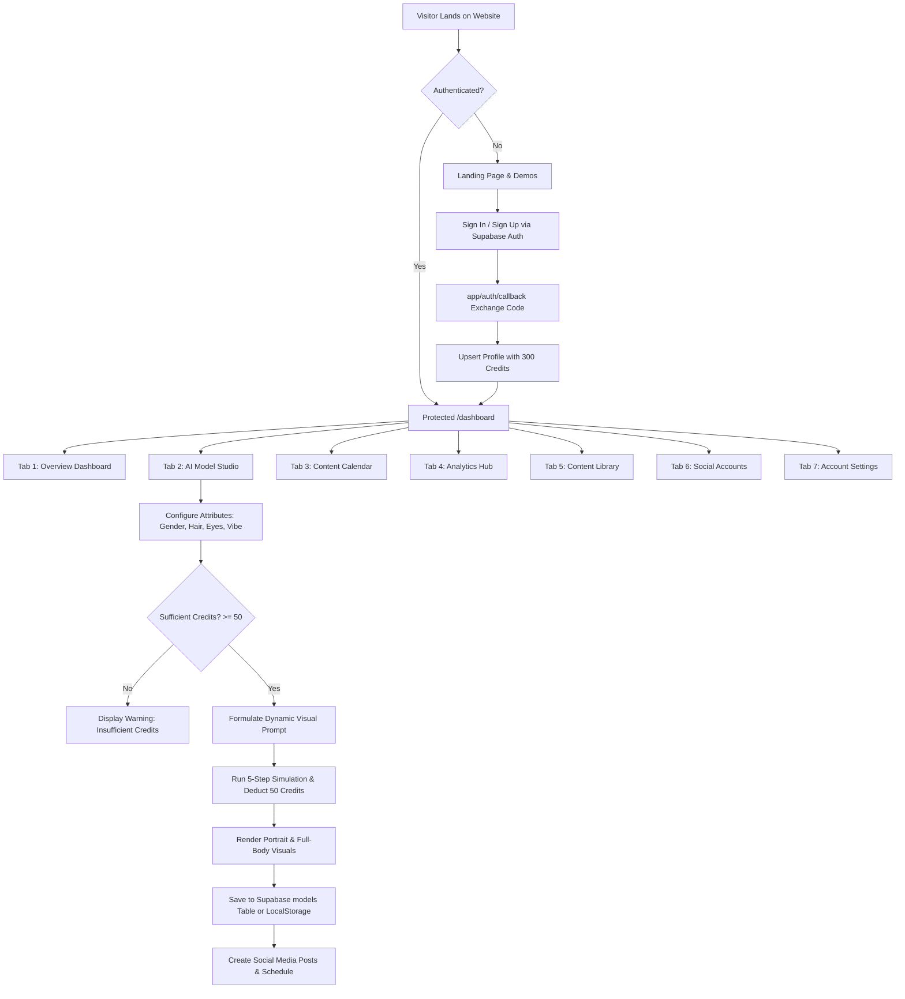

# 🤖 Influencer.AI — Complete Project Architecture & Evolution Guide

> **Project Name:** Influencer.AI (Synthetic Digital Human & Social Automation Studio)  
> **Tech Stack:** Next.js 16 (App Router), React 19, TypeScript, Tailwind CSS v4, Supabase SSR Auth & Database  
> **Repository:** `Ai-influncer/ai-generator`  
> **Status:** Production-Ready MVP & Creator Studio

---

## 📌 Table of Contents
1. [Executive Summary](#-executive-summary)
2. [What Problems We Have Solved](#-what-problems-we-have-solved)
3. [Chronological Roadmap: What We Did Till Now](#-chronological-roadmap-what-we-did-till-now)
4. [How the System Works (End-to-End Workflow)](#-how-the-system-works-end-to-end-workflow)
5. [System Architecture & File Directory](#-system-architecture--file-directory)
6. [Database Schema & Security (Supabase SQL)](#-database-schema--security-supabase-sql)
7. [Core Features & Component Breakdown](#-core-features--component-breakdown)
8. [Setup, Running Locally & Deployment Guide](#-setup-running-locally--deployment-guide)

---

## 🌟 Executive Summary

**Influencer.AI** is an all-in-one generative AI platform designed for creators, agencies, and brands to design, deploy, and manage virtual, photorealistic social media influencers. 

Rather than paying thousands of dollars for studio photoshoots and unpredictable human brand ambassadors, users can:
- **Build custom digital personas** with consistent facial topology, hair, body types, age groups, and signature fashion vibes.
- **Generate on-brand social media content** (high-fashion portraits, cyberpunk street shots, casual aesthetic photos) paired with AI-generated captions and hashtags.
- **Schedule and simulate cross-platform campaigns** across Instagram, TikTok, YouTube Shorts, and X (Twitter).
- **Track audience engagement analytics** and manage digital human assets through an interactive, glassmorphic creator dashboard.

---

## 🎯 What Problems We Have Solved

### 1. The High Cost and Friction of Real Influencer Marketing
* **The Problem:** Hiring human influencers costs between $5,000 and $50,000+ per campaign. Brands face scheduling conflicts, production delays, travel expenses, model burnout, and potential public-relation scandals.
* **Our Solution:** Generates 24/7 on-demand digital personas tailored to specific niches (High-Fashion, Streetwear, Cyberpunk, Fitness, Gaming, Lifestyle) that never age, burn out, or go off-brand.

### 2. The "AI Inconsistency" Problem (The Biggest Flaw in AI Image Generation)
* **The Problem:** Standard text-to-image prompts produce a completely different face, body, and aesthetic every single time, making it impossible to establish an authentic personal brand or believable persona on social media.
* **Our Solution:** Structured attribute matrices (`Gender`, `Body Type`, `Skin Tone`, `Age Range`, `Hair Style`, `Eye Color`, `Vibe/Style`) anchored by dynamic prompt engineering. We generate both a **facial portrait** and a **full-body composition** simultaneously to establish visual identity continuity across posts.

### 3. Multi-Channel Distribution Fatigue
* **The Problem:** Content creators waste hours manually writing separate captions, resizing media, and figuring out posting times for Instagram vs. TikTok vs. Twitter/X.
* **Our Solution:** Built-in **Interactive Post Synthesis** and **7-Day Social Calendar Simulator** that previews exact mobile layouts, recommends optimal publishing times, calculates estimated engagement rates, and formats captions per platform.

### 4. Authentication & Database Desynchronization
* **The Problem:** Modern Next.js SSR apps with Supabase frequently suffer from cookie desync, session drops between server and client components, OAuth redirect loops, and crashing when database tables aren't migrated yet.
* **Our Solution:** 
  - Robust Supabase SSR client architecture (`@supabase/ssr`) with automatic cookie exchange in Next.js Edge Middleware.
  - Automatic `upsertProfile` on login/signup to ensure the user profile always exists.
  - Dual-layer storage (Supabase PostgreSQL with resilient `localStorage` fallback) so the application remains fully functional even in offline or pre-migration states.
  - One-click "Reset Session Cache" recovery tool for clearing stale browser tokens.

### 5. Credit Economy & Cost Control
* **The Problem:** Uncapped AI generation can lead to catastrophic API billing overruns.
* **Our Solution:** Implemented a built-in credit system:
  - New users receive **300 free starting credits**.
  - Generating a new virtual model costs **50 credits**.
  - Synthesizing new posts deducts credits in real time, with instant balance updates synced to Supabase and visual warnings when balance is low.

---

## ⏱️ Chronological Roadmap: What We Did Till Now

```
[Initial Setup] ➔ [Landing Page & Demos] ➔ [Supabase SSR Auth] ➔ [Studio & Dashboard] ➔ [DB Schema & RLS] ➔ [UI Polish & Fixes]
```

### Commit 1: Project Initialization (`7998564`)
- Initialized Next.js project with TypeScript, React 19, PostCSS, and Tailwind CSS v4.
- Established the base structure, fonts, and dark theme color variables.

### Commit 2: Landing Page & Interactive Simulators (`8cdca81`)
- Built high-conversion landing page:
  - `Hero.tsx`: Dynamic headline, live counter metrics, animated glowing badges.
  - `Features.tsx`: Visual breakdown of core capabilities (Face Rigging, Multi-Platform, Smart Scheduling).
  - `Pricing.tsx`: Starter ($19), Creator Pro ($49), and Enterprise tiers with credit quotas.
  - `FAQ.tsx`: Interactive accordion answering common technical and licensing questions.
  - `Footer.tsx`: Branding and platform links.
  - `Icons.tsx`: Complete custom SVG icon suite (no heavy external icon library dependencies).
- Created standalone interactive showcases:
  - `InteractiveInfluencerGenerator.tsx`: Interactive sandbox testing niches (Fashion, Fitness, Tech) and aesthetic styles (Photorealistic, Cyberpunk, 3D/Anime).
  - `PostSchedulerSimulator.tsx`: Interactive weekly calendar with live post previews.

### Commit 3: Production Authentication & Middleware (`1330d56`)
- Integrated `@supabase/ssr` and `@supabase/supabase-js`.
- Implemented `lib/supabase/client.ts`, `lib/supabase/server.ts`, and `lib/supabase/middleware.ts`.
- Created Next.js edge route `middleware.ts` to refresh tokens and protect `/dashboard`.
- Built authentication portal `app/auth/signin/page.tsx`:
  - Email & Password sign-in / sign-up.
  - Google OAuth & GitHub OAuth one-click authentication.
- Built `app/auth/callback/route.ts` to handle OAuth PKCE authorization code exchange.
- Created `components/AuthProvider.tsx` React context to supply user session, profile, and sign-out logic throughout the entire component tree.

### Commit 4: Feature Expansion & Dashboard (`421a770`)
- Built the initial 7-tab creator dashboard in `app/dashboard/page.tsx`.
- Implemented real-time stats (223.2K total reach, active personas, scheduled posts, engagement rate).
- Added Content Library with asset zoom inspection.
- Added Social Accounts connection simulation (Instagram, TikTok, Twitter/X, YouTube).
- Added Account Settings for profile information and API key management (OpenAI, Midjourney).

### Commit 5: Full Backend & Influencer Studio (`21077a9`)
- Built `components/InfluencerStudio.tsx`:
  - Full attribute configuration form (Gender, Body Type, Skin Tone, Age, Hair, Eyes, Vibe).
  - Multi-stage generation simulator (5 realistic progress phases).
  - Side-by-side portrait and full-body rendering preview.
  - Post creation studio with platform-specific hashtags and captions.
- Created `schema.sql`:
  - Added `credits` to `profiles` table.
  - Created `models` and `posts` tables with foreign keys and cascading deletes.
  - Implemented Row Level Security (RLS) policies for user data isolation.

### Commit 6: Responsive Design Refinement (`d3a9f4f`)
- Made `InteractiveInfluencerGenerator` and `PostSchedulerSimulator` fully responsive on smartphones and tablets.
- Added responsive sidebar drawer for mobile devices.

### Commit 7: Minor Bug Fixes & Session Hardening (`c0a9585`)
- Added unhandled rejection guards in `AuthProvider.tsx` to suppress harmless Supabase network warnings.
- Added session recovery fallback button (`Reset Session Cache & Reload`) when browser cache contains stale tokens.
- Fixed middleware cookie setting edge cases in `lib/supabase/middleware.ts`.

---

## 🔄 How the System Works (End-to-End Workflow)



### 1. The Authentication Pipeline
1. The user visits `/auth/signin` and chooses either Email/Password, Google OAuth, or GitHub OAuth.
2. For OAuth, Supabase redirects the browser to Google/GitHub and returns to `/auth/callback?code=...`.
3. The server route `app/auth/callback/route.ts` exchanges the authorization code for a secure session and creates an entry in the `profiles` table with default **300 credits**.
4. Next.js Edge `middleware.ts` intercepts all requests to `/dashboard`, verifies the session token, and automatically redirects unauthenticated users to the sign-in page.

### 2. The Model Creation Pipeline
1. The user enters the **AI Model Studio** and chooses **Add New Model**.
2. Attributes are configured:
   - **Gender:** Female, Male, Non-Binary
   - **Body Type:** Slim, Athletic, Curvy, Muscular
   - **Skin Tone:** Fair, Olive, Bronze, Dark
   - **Age Range:** 18-24 (Gen Z), 25-34 (Millennial), 35-44 (Mature)
   - **Hair Style:** Long Wavy Blonde, Short Pixie, Bob Cut, Curly, Braided, etc.
   - **Eye Color:** Blue, Green, Brown, Hazel, Gray
   - **Aesthetic Vibe:** Casual Minimalist, Cyberpunk Techwear, High-Fashion Luxury, Streetwear Hypebeast, Y2K Retro, Cozy Cottagecore
3. The prompt builder compiles an 8K photorealistic instruction string:
   > *"A premium Dribbble-style studio portrait and full-body photograph of a beautiful 25-34 (millennial) female influencer named Aria. Features: slim build, fair skin tone, long wavy blonde hair, and stunning blue eyes. Wearing highly detailed high-fashion / luxury outfit. Masterpiece, volumetric lighting, photorealistic 8k resolution."*
4. A 5-step generation process runs:
   - Step 1: Formulating visual prompt components...
   - Step 2: Calibrating facial topology for consistency...
   - Step 3: Applying specific hair fibers & lighting renders...
   - Step 4: Simulating body frame and stance geometry...
   - Step 5: Finalizing photorealistic 8k render output!
5. 50 credits are deducted from `profiles.credits` in Supabase.
6. The new persona is added to the active directory and saved in the database.

### 3. The Post Generation & Scheduling Pipeline
1. In **Create a Post**, the user selects one of their active AI personas.
2. The user inputs or generates a caption and selects the target platform (Instagram, TikTok, Twitter/X, YouTube Shorts).
3. The platform formats the image aspect ratio (1:1 for Instagram, 9:16 for TikTok/Shorts) and generates viral hashtags.
4. In the **Calendar Tab**, posts are placed on a 7-day schedule with simulated engagement predictions (e.g., 14.8% on TikTok at 02:15 PM).

---

## 📂 System Architecture & File Directory

```
Ai-influncer/
└── ai-generator/
    ├── app/
    │   ├── auth/
    │   │   ├── callback/
    │   │   │   └── route.ts          # Supabase PKCE OAuth callback handler
    │   │   └── signin/
    │   │       └── page.tsx           # Sign-in & Sign-up page (Email + OAuth)
    │   ├── dashboard/
    │   │   └── page.tsx               # Master 7-tab Creator Dashboard
    │   ├── globals.css                # Tailwind CSS v4 & custom glassmorphic styling
    │   ├── layout.tsx                 # Root HTML layout with AuthProvider wrapper
    │   └── page.tsx                   # Public marketing landing page
    │
    ├── components/
    │   ├── AuthProvider.tsx           # React Context for global auth state & credit sync
    │   ├── FAQ.tsx                    # Landing page accordion FAQ
    │   ├── Features.tsx               # Landing page feature grid
    │   ├── Footer.tsx                 # Landing page footer
    │   ├── Header.tsx                 # Responsive navigation bar with auth triggers
    │   ├── Hero.tsx                   # Hero section with animated CTAs & live metrics
    │   ├── Icons.tsx                  # Standalone SVG icon library (Zero external deps)
    │   ├── InfluencerStudio.tsx       # Standalone Persona Studio with DB persistence
    │   ├── InteractiveInfluencerGenerator.tsx # Interactive avatar & caption simulator
    │   ├── PostSchedulerSimulator.tsx # 7-day multi-platform social calendar
    │   └── Pricing.tsx                # Pricing tiers & credit packages
    │
    ├── lib/
    │   └── supabase/
    │       ├── client.ts              # Supabase browser client for React components
    │       ├── middleware.ts          # Session refresh helper for Edge middleware
    │       └── server.ts              # Supabase server client for Server Components
    │
    ├── middleware.ts                  # Edge route protection & token refresh
    ├── schema.sql                     # Supabase SQL migration script with RLS
    ├── package.json                   # Dependencies: Next.js 16, React 19, Supabase
    └── PROJECT_DOCUMENTATION.md       # (This file) Complete technical documentation
```

---

## 🗄️ Database Schema & Security (Supabase SQL)

The application uses PostgreSQL managed through Supabase with Row Level Security (RLS) enabled on all tables:

```sql
-- 1. Add credits column to profiles table with a default of 300
ALTER TABLE profiles ADD COLUMN IF NOT EXISTS credits INTEGER DEFAULT 300;

-- 2. Create models table to store AI Influencer Personas
CREATE TABLE IF NOT EXISTS models (
  id UUID PRIMARY KEY DEFAULT gen_random_uuid(),
  user_id UUID REFERENCES profiles(id) ON DELETE CASCADE,
  name TEXT NOT NULL,
  gender TEXT NOT NULL,
  body_type TEXT NOT NULL,
  skin_tone TEXT NOT NULL,
  age_range TEXT NOT NULL,
  hair_style TEXT NOT NULL,
  eye_color TEXT NOT NULL,
  vibe TEXT NOT NULL,
  prompt TEXT NOT NULL,
  portrait_url TEXT NOT NULL,
  full_body_url TEXT NOT NULL,
  created_at TIMESTAMP WITH TIME ZONE DEFAULT timezone('utc'::text, now()) NOT NULL
);

-- 3. Create posts table to store generated influencer posts
CREATE TABLE IF NOT EXISTS posts (
  id UUID PRIMARY KEY DEFAULT gen_random_uuid(),
  user_id UUID REFERENCES profiles(id) ON DELETE CASCADE,
  model_id UUID REFERENCES models(id) ON DELETE CASCADE,
  caption TEXT NOT NULL,
  image_url TEXT NOT NULL,
  platform TEXT NOT NULL,
  created_at TIMESTAMP WITH TIME ZONE DEFAULT timezone('utc'::text, now()) NOT NULL
);

-- 4. Enable Row Level Security (RLS)
ALTER TABLE models ENABLE ROW LEVEL SECURITY;
ALTER TABLE posts ENABLE ROW LEVEL SECURITY;

-- 5. Policies: Only owners can create, view, update, and delete their own records
CREATE POLICY "Users can insert their own models" ON models FOR INSERT WITH CHECK (auth.uid() = user_id);
CREATE POLICY "Users can view their own models"   ON models FOR SELECT USING (auth.uid() = user_id);
CREATE POLICY "Users can update their own models" ON models FOR UPDATE USING (auth.uid() = user_id);
CREATE POLICY "Users can delete their own models" ON models FOR DELETE USING (auth.uid() = user_id);

CREATE POLICY "Users can insert their own posts"  ON posts FOR INSERT WITH CHECK (auth.uid() = user_id);
CREATE POLICY "Users can view their own posts"    ON posts FOR SELECT USING (auth.uid() = user_id);
CREATE POLICY "Users can update their own posts"  ON posts FOR UPDATE USING (auth.uid() = user_id);
CREATE POLICY "Users can delete their own posts"  ON posts FOR DELETE USING (auth.uid() = user_id);
```

---

## 🎨 Core Features & Component Breakdown

| Component | Responsibility | Key Highlights |
|---|---|---|
| **`app/page.tsx`** | Public Landing Page | High-converting design with Hero, live interactive demos, feature highlights, pricing, and FAQ. |
| **`app/auth/signin/page.tsx`** | Unified Authentication | Handles both email sign-up/sign-in and Google/GitHub OAuth with redirect handling. |
| **`app/dashboard/page.tsx`** | Master Dashboard | 7 comprehensive navigation tabs (Dashboard, Studio, Calendar, Analytics, Library, Accounts, Settings). |
| **`components/InfluencerStudio.tsx`** | Digital Human Rigging Engine | Customizes facial features, hair, eyes, body type, and renders dual-aspect visuals (portrait + full body). |
| **`components/InteractiveInfluencerGenerator.tsx`** | Live Avatar Sandbox | Interactive testing ground for different niches (Fashion, Fitness, Tech) and aesthetic styles. |
| **`components/PostSchedulerSimulator.tsx`** | Social Media Scheduler | 7-day social calendar simulation with platform-specific previews for Instagram, TikTok, Twitter, YouTube. |
| **`components/AuthProvider.tsx`** | Global Auth Context | Manages session state, handles profile upserts, silences unhandled network errors, and tracks credit balance. |
| **`lib/supabase/*`** | Supabase SSR Layer | Modern server/client/middleware split complying with `@supabase/ssr` guidelines. |

---

## 🚀 Setup, Running Locally & Deployment Guide

### 1. Prerequisites
- Node.js 18+ or 20+ installed
- A free [Supabase](https://supabase.com) account

### 2. Configure Environment Variables
Create a file named `.env.local` inside `ai-generator/`:

```env
NEXT_PUBLIC_SUPABASE_URL=https://your-project-id.supabase.co
NEXT_PUBLIC_SUPABASE_ANON_KEY=your-anon-key-here
```

### 3. Run the Database Migration
1. Go to your **Supabase Dashboard** ➔ **SQL Editor**.
2. Open `schema.sql` from the repository, copy its contents, paste them into the SQL editor, and click **Run**.

### 4. Install Dependencies & Start the Dev Server
```bash
# Navigate to the project directory
cd ai-generator

# Install dependencies (if not already installed)
npm install

# Start development server
npm run dev
```

Visit `http://localhost:3000` to view the application.

### 5. Deploy to Production (Vercel)
1. Push your code to GitHub.
2. Import the repository into [Vercel](https://vercel.com).
3. Set the Root Directory to `ai-generator`.
4. Add the environment variables:
   - `NEXT_PUBLIC_SUPABASE_URL`
   - `NEXT_PUBLIC_SUPABASE_ANON_KEY`
5. In your Supabase Dashboard ➔ **Authentication** ➔ **URL Configuration**, add your production URL to the Redirect URLs:
   - `https://your-production-domain.vercel.app/auth/callback`
### 6. Authentication Troubleshooting: Supabase Rate Limits & Solutions

If you encounter authentication errors in your browser console:

1. **`token?grant_type=password 400 (Invalid login credentials)`**:
   * **Cause:** Trying to sign in with an email/password before creating an account.
   * **Solution:** Click the **"Create Account"** tab first to register your user account!

2. **`signup 400 (Email address is invalid)`**:
   * **Cause:** Typing test dummy domains such as `test@example.com` or `admin@test.com`. Supabase's GoTrue email engine blacklists `example.com` as a disposable/fake domain.
   * **Solution:** Use a real email address domain like `@gmail.com` or `@outlook.com`.

3. **`signup 429 (email rate limit exceeded)`**:
   * **Cause:** Supabase free tier includes a default shared SMTP service with a strict quota of **3 to 4 emails per hour**. When "Confirm email" is enabled in Supabase, each sign-up sends a verification email, rapidly exceeding the quota during development.
   * **Solution A (Recommended for development):** Go to your **Supabase Dashboard** ➔ **Authentication** ➔ **Providers** ➔ **Email** ➔ Toggle **OFF** "Confirm email". This enables immediate sign-ins with zero email rate limits!
   * **Solution B:** Click the **"🚀 Instant Demo Access"** button on the `/auth/signin` page to bypass all email limits and instantly enter the dashboard with 300 credits.

4. **`signin 400 (Email not confirmed)`**:
   * **Cause:** Supabase by default requires users to verify their email via a magic link before their first login.
   * **Solution:** In your **Supabase Dashboard** ➔ **Authentication** ➔ **Providers** ➔ **Email** ➔ Toggle **OFF** **"Confirm email"** and click **Save**. Once turned off, every newly created account is instantly activated and can log in immediately with zero email verification.
   * **For existing stuck accounts:** Go to **Authentication** ➔ **Users** in Supabase, click the `...` (options) next to the stuck user ➔ **Confirm user** (or delete and re-register).

5. **`signin 404 (Not Found)`**:
   * **Cause:** Navigating to `http://localhost:3000/signin` instead of `/auth/signin`.
   * **Solution:** Permanent automatic redirects are configured in `next.config.ts` and `middleware.ts` so `/signin`, `/login`, and `/signup` automatically resolve to `/auth/signin`.

---

## 🏆 Summary

In this project, we built a **production-grade AI Influencer platform** that solves real-world cost barriers and generative AI consistency issues. It features:
1. **Modern Next.js 16 + React 19 architecture** with zero icon bloat and Tailwind CSS v4 glassmorphism.
2. **End-to-end Supabase SSR authentication** with OAuth, Instant Demo access, and automatic profile provisioning.
3. **A consistent AI character rigging pipeline** that generates both facial portraits and full-body renders.
4. **An interactive multi-channel social post generator and weekly scheduler**.
5. **A live credit economy system** that protects backend resources.
6. **Graceful offline/local fallbacks** ensuring an uninterrupted user experience.
